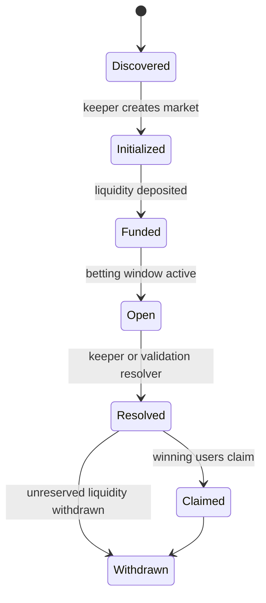

# Market Lifecycle

## Lifecycle Stages



## Discover fixture

The app reads TxLINE fixtures and normalizes participant names, kickoff time, match phase, and score status.



## Initialize market

A keeper creates a market PDA for the fixture and market type. For the AMM contract, TxLINE odds seed the initial probability vector.



## Fund vault

The market authority deposits devnet SOL liquidity into the vault PDA so user payouts can be covered.



## Place prediction

The app builds a transaction, the wallet signs it, and the program records the user position.



## Resolve result

Demo settlement is authority-controlled. The trustless path replaces this with TxLINE validation CPI.



## Claim or withdraw

Winners claim from the vault. The market authority can withdraw liquidity that is not reserved for outstanding liability.


