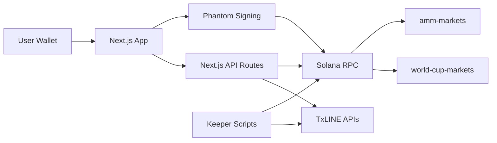

# System Overview

PenaltyMarket separates user-facing product flows from data ingestion and on-chain settlement.

## Components

| Component | Responsibility |
|---|---|
| `frontend/` | App router UI, wallet connection, match pages, portfolio, API routes |
| `frontend/app/api/*` | Server-side TxLINE proxying and Solana reads/transaction construction |
| `world-cup-markets/` | Existing deployed escrow contract used by the frontend |
| `amm-markets/` | New standalone AMM Anchor program |
| `keeper/` | Initialization, funding, demo settlement, and liquidity scripts |
| TxLINE | Fixture, score, odds, and validation data |

## Security Boundary

TxLINE credentials are only used on the server side. Browser code calls the app's own API routes, not TxLINE directly.


All wallet transactions are built server-side and signed client-side. The frontend never receives TxLINE API credentials.

