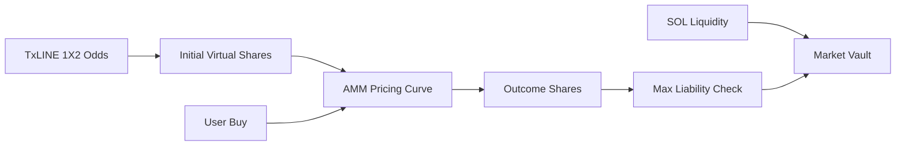

# AMM Contract

The new AMM contract lives in `amm-markets/`.

```text
Program ID: EbdvTA5GAHZru1f2pwAnu2mPgaWuZQBXXKz16VUiJXvM
Network: Solana devnet
```

## Why Separate

The current contract is useful for demo reliability. The AMM contract is a clean new track that can become the production market mechanism without risking the demo.

## AMM Design

- TxLINE odds seed the opening probability vector.
- The market creates virtual shares from those probabilities.
- Users buy exact outcome shares.
- The selected outcome price rises as more shares are bought.
- If an outcome wins, each winning share redeems 1 lamport.
- Vault collateral must always cover the largest outstanding outcome liability.



## Accounts

| Account | Purpose |
|---|---|
| `AmmMarket` | Fixture, market type, options, virtual shares, sold shares, liquidity, status |
| `AmmPosition` | User-owned position with outcome, shares, cost, and claim flag |
| `AmmVault` | SOL vault PDA tied to one market |

## Instructions

| Instruction | Purpose |
|---|---|
| `initialize_market` | Create AMM market and seed probabilities |
| `deposit_liquidity` | Add devnet SOL liquidity |
| `buy_shares` | Buy outcome shares with slippage protection |
| `quote_buy_exact_shares` | Emit quote data |
| `resolve_market` | Demo resolver |
| `claim_position` | Claim winning shares |
| `withdraw_liquidity` | Withdraw unreserved liquidity |


The current AMM resolver is demo-authority based. The intended production path is replacing resolver authorization with TxLINE proof validation CPI.

