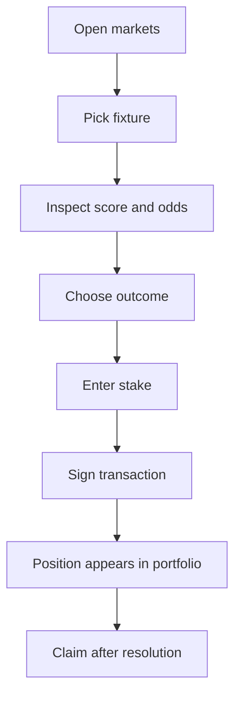

# Application Flow

The frontend is a Next.js app router application with a soccer-terminal interface.

## Pages

| Route | Purpose |
|---|---|
| `/` | Market board with upcoming/live fixtures |
| `/match/[fixtureId]` | Match terminal, live score, odds chart, bet slip, prop markets |
| `/portfolio` | Connected wallet positions |
| `/verify/[tx]` | Proof/transaction verification view |

## User Flow

## State and Fetching

The app uses a combination of:

- React Query polling for fixture/market state
- Zustand for shared frontend state
- Server-side API routes for TxLINE calls
- Solana RPC reads for market and position state
- SSE streams for live score and odds updates where useful

## Design Goal

The UI is intentionally soccer-first:

- green field palette
- black and white contrast
- match cards with short team codes
- live score panels
- odds chart for match-winner probability
- simple bet slip with clear payout estimate
