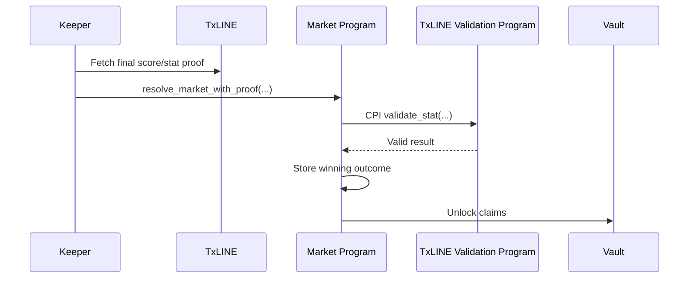

# Validation Strategy

TxLINE provides Merkle proof endpoints for fixtures, odds, and score statistics. These proofs are the bridge between off-chain sports data and on-chain settlement.

## Proof Types

| Data | Purpose |
|---|---|
| Fixture proof | Verify fixture metadata and scheduled match identity |
| Odds proof | Verify an odds update used for pricing or AMM seeding |
| Score statistic proof | Verify final match statistics used for settlement |

## Target Settlement Flow

## Current Demo Reality

The current demo uses keeper-driven resolution so the demo video can show a complete lifecycle before real matches end.

The code is structured so proof-backed settlement can replace the resolver implementation without changing:

- market account layout
- user position layout
- vault accounting
- claim flow
- liquidity withdrawal rules


For hackathon evaluation, the demo shows the full product flow. The roadmap shows exactly where TxLINE validation CPI becomes the permissionless settlement layer.

